---
lab:
    title: 'Get started with Eventstream in Microsoft Fabric'
    module: 'Get started with Eventstream in Microsoft Fabric'
---
# Get started with Eventstream in Microsoft Fabric

Eventstream is a feature in Microsoft Fabric that captures, transforms, and routes real-time events to various destinations with a no-code experience. You can add event data sources, routing destinations, and the event processor, when the transformation is needed, to the eventstream. Microsoft Fabric's EventStore is a monitoring option that maintains events from the cluster and provides a way to understand the state of your cluster or workload at a given point in time. The EventStore service can be queried for events that are available for each entity and entity type in your cluster. This means you can query for events on different levels, such as clusters, nodes, applications, services, partitions, and partition replicas. The EventStore service also has the ability to correlate events in your cluster. By looking at events that were written at the same time from different entities that may have impacted each other, the EventStore service can link these events to help with identifying causes for activities in your cluster. Another option for monitoring and diagnostics of Microsoft Fabric clusters is aggregating and collecting events using EventFlow.

This lab takes approximately **30** minutes to complete.

> **Note**: You need a [Microsoft Fabric trial](https://learn.microsoft.com/fabric/get-started/fabric-trial) to complete this exercise.

## Create a workspace

Before working with data in Fabric, create a workspace with the Fabric trial enabled.

1. Sign into the [Microsoft Fabric home page](https://app.fabric.microsoft.com/home?experience=fabric) at `https://app.fabric.microsoft.com/home?experience=fabric` and select **Power BI**.
2. In the menu bar on the left, select **Workspaces** (the icon looks similar to &#128455;).
3. Create a new workspace with a name of your choice, selecting a licensing mode that includes Fabric capacity (*Trial*, *Premium*, or *Fabric*).
4. When your new workspace opens, it should be empty, as shown here:

   
5. At the bottom left of the Power BI portal, select the **Power BI** icon and switch to the **Real-Time Intelligence** experience.

## Scenario

With Fabric eventstreams, you can easily manage your event data in one place. You can collect, transform, and send real-time event data to different destinations in the format you want. You can also connect your eventstreams with Azure Event Hubs, KQL database, and Lakehouse without any hassle.

This lab is based on sample streaming data called Stock Market Data. The Stock Market sample data is a dataset of a stock exchange with a preset schema column such as time, symbol, price, volume and more. You'll use this sample data to simulate real-time events of stock prices and analyze them with various destinations, such as the KQL database.

Use Real-Time Intelligence streaming and query capabilities to answer key questions about the stock statistics. In this scenario, we're going to take full advantage of the wizard instead of manually creating some components independently, such as the KQL Database.

In this tutorial, you'll learn how to:

- Create an Eventhouse
- Create a KQL database
- Enable data copy to OneLake
- Create an eventstream
- Stream data from an eventstream to your KQL database
- Explore data with KQL and SQL\

## Create a Real-Time Intelligence Eventhouse

1. Select the Real-Time Intelligence option in Microsoft Fabric.
1. Select Eventhouse from the menubar, and give your eventhouse a name.
    
    

## Create a KQL Database

1. Within the **Real-Time Intelligence Eventhouse** Dashboard, select the **KQL Database +** box.
1. You'll have the option to name your database and select a **New database (default)** or create a **New shortcut database (follower)**.
1. Select **Create**.

     >**Note:**
     > The follower database feature allows you to attach a database located in a different cluster to your Azure Data Explorer cluster. The follower database
    is attached in read-only mode, making it possible to view the data and run queries on the data that was ingested into the leader database . The follower database synchronizes changes in the leader databases. Because of the synchronization, there's a data lag of a few seconds to a few minutes in data availability. The length of the time lag depends on the overall size of the leader database metadata. The leader and follower databases use the same storage account to fetch the data. The storage is owned by the leader database. The follower database views the data without needing to ingest it. Since the attached database is a read-only database, the data, tables, and policies in the database can't be modified except for
    caching policy, principals, and permissions.

   

4. You'll be prompted to **Name** the KQL Database

   

5. Give the KQL Database a name that you'll remember, such as **Eventhouse-HR**, press **Create**.

6. In the **Database details** panel, select the pencil icon to turn on availability in OneLake.

   [ 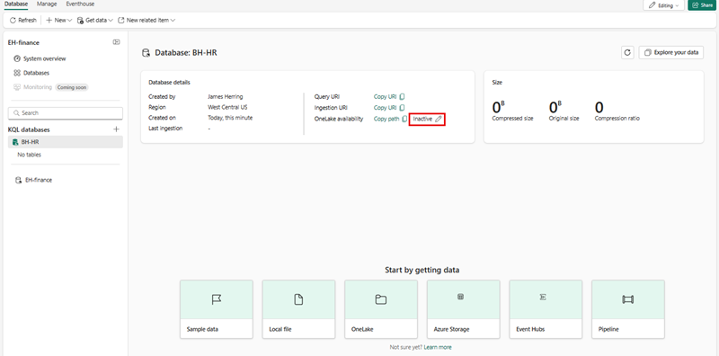 ](./Images/enable-onelake-availability-large.png)

7. Make sure to toggle the button to **Active** and then select **Done**.

   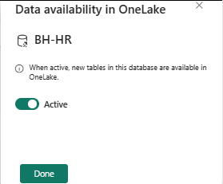

## Create an Eventstream

1. In the menu bar, select **Real-Time Intelligence** (the icon looks similar to )
2. Under **New**, select **EventStream**

   

3. You'll be prompted to **Name** your eventstream. Give the EventStream a name that you'll remember, such as **MyStockES**, and select the **Enhanced Capabilities (preview)** option and select the **Create** button.

   

     >**Note:**
     > The creation of your new event stream in the workspace will be completed in just a few moments. Once established, you will be automatically redirected to the primary editor, ready to begin integrating sources into your event stream.

## Establish an eventstream source

1. In the Eventstream canvas, select **New source** from the drop-down list, then select **Sample Data**.

    

2.  In the **Add source**, give your source a name, and select **Bicycles (Reflex compatible)**
3.  Select the **Add** button.

    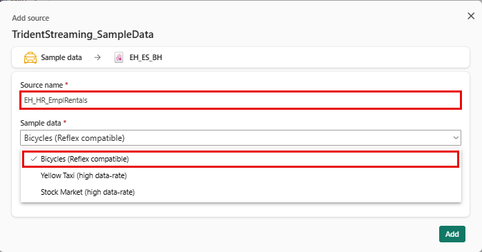

4. Once selecting the **Add** button, your stream will be mapped and you will be automotically redirected to the **eventstream canvas**.

   [ 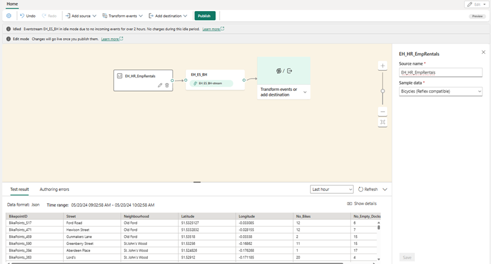 ](./Images/real-time-intelligence-eventstream-sourced-large.png#lightbox)
 
 > **Note:**
 > After you create the sample data source, you see it added to your eventstream on the canvas in Edit mode. To implement this newly added sample data, select **Publish**.

## Add a transform events or add destination activity

1. After publishing, you can select the **Transform events or add destination** and then, select **KQL Database** as an option.

   

2. You'll see a new side panel open up that gives you many options. Enter the necessary details of your KQL Database.

   [ 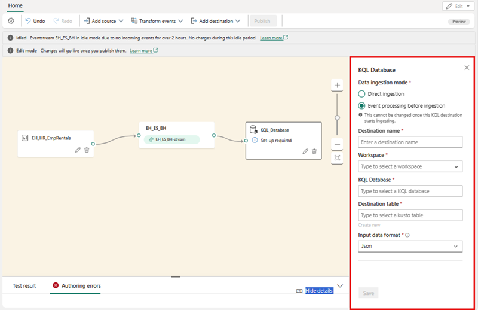 ](./Images/kql-database-event-processing-before-ingestion.png)

    - **Data ingestion mode:** There are two ways of ingesting data into KQL Database:
        - ***Direct ingestion:*** Ingest data directly to a KQL table without any transformation.
        - ***Event processing before ingestion:*** Transform the data with Event Processor before sending to a KQL table.      
        
        > **Warning:** You **CANNOT** edit the ingestion mode once the KQL database destination is added to the eventstream.     

   - **Destination name:** Enter a name for this Eventstream destination, such as "kql-dest".
   - **Workspace:** Where your KQL database is located.
   - **KQL database:** Name of your KQL Database.
   - **Destination table:** Name of your KQL table. You can also enter a name to create a new table, for example, "bike-count."
   - **Input data format:** Choose JSON as the data format for your KQL table.

3. Select **Save**. 
4. Select **Publish**.

## Transform the events

1. Within the **eventstream** canvas, select **Transform events**.

    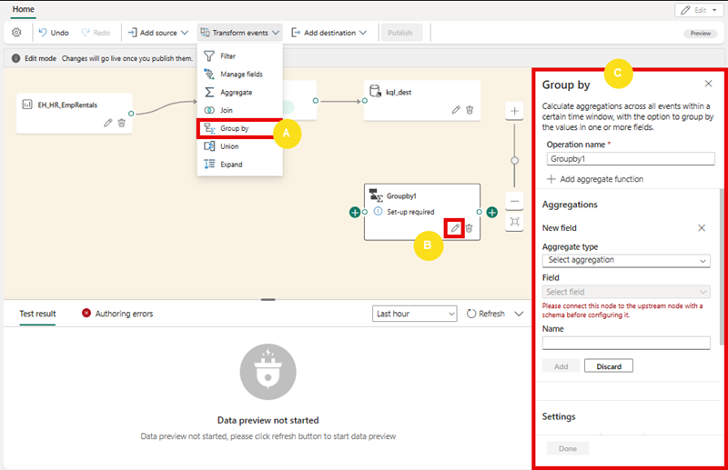

    A. Select **Group by**.

    B. Select **Edit** depicted by the ***pencil*** icon.

    C. Once you create the **Group by** transform event, you will need to connect it from the **eventstream** to the **Group by**. You accomplish this without the use of code by clicking on the dot on the right hand side of the **eventstream** and dragging it to the dot on the left side of the new **group by** box. 

    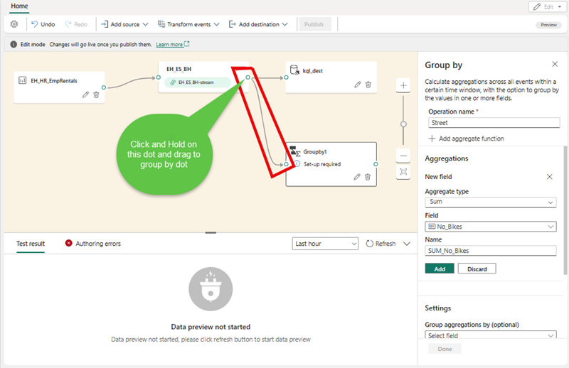    

2. Fill out the properties of the **Group by** settings section:
    - **Operation name:** Enter a name for this transformation event
    - **Aggregate type:** Sum
    - **Field:** No_Bikes
    - **Name:** SUM_No_Bikes
    - **Group aggregations by:** Street
      
3. Select **Add** and then select **Save**.

4. In the same manner, you can mouse-over the arrow between the **event stream** and the ***kql-dest*** and select the ***garbage can**. You can then connect the **Group by** event to **kql-dest**.

   [ 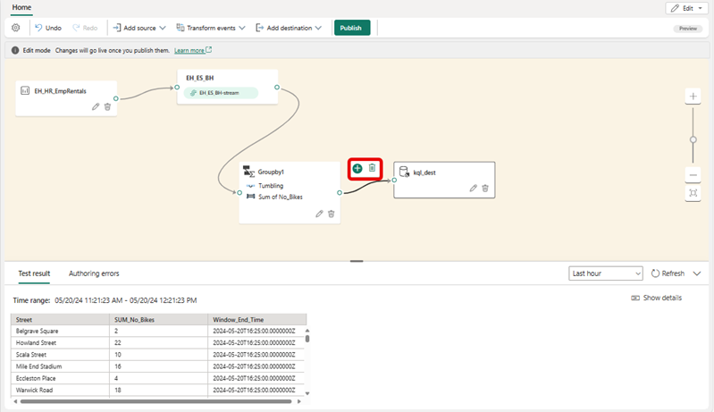 ](./Images/delete-flow-arrows-large.png)

    > **Note:**
    > Whenever you add or remove connectors, you will need to re-configure the destination objects.

5. Select the pencil under **kql-dest** and create a new destination table named **Bike_sum** that will receive the output of the **Group by** event.

## KQL Queries

Kusto Query Language (KQL) is a read-only request to process data and return results. The request is stated in plain text, using a data-flow model that is easy to read, author, and automate. Queries always run in the context of a particular table or database. At a minimum, a query consists of a source data reference and one or more query operators applied in sequence, indicated visually by the use of a pipe character (|) to delimit operators. For more information on the Kusto Query Language, see [Kusto Query Language (KQL) Overview](https://learn.microsoft.com/en-us/azure/data-explorer/kusto/query/?context=%2Ffabric%2Fcontext%2Fcontext)

> **Note**: The KQL Editor comes with both syntax and Inellisense highlighting, which allows you to quickly gain knowledge of the Kusto Query Language (KQL).

1. Browse to your newly created and hydrated KQL Database:

    A.  Select the **kql-dest** 

    B. Select the **Open item** hyperlink located in the **Related item** row

   [ 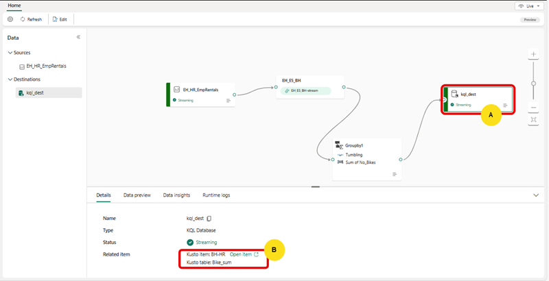 ](./Images/navigate-to-data-large.png)

1. In the Data tree, select the More menu [...] on the ***Bike_sum*** table. Then select Query table > Show any 100 records.

   

3. The sample query opens in the **Explore your data** pane with the table context already populated. This first query uses the `take` operator to return a sample number of records, and is useful to get a first look at the data structure and possible values. The auto populated sample queries are automatically run. You can see the query results in the results pane.

   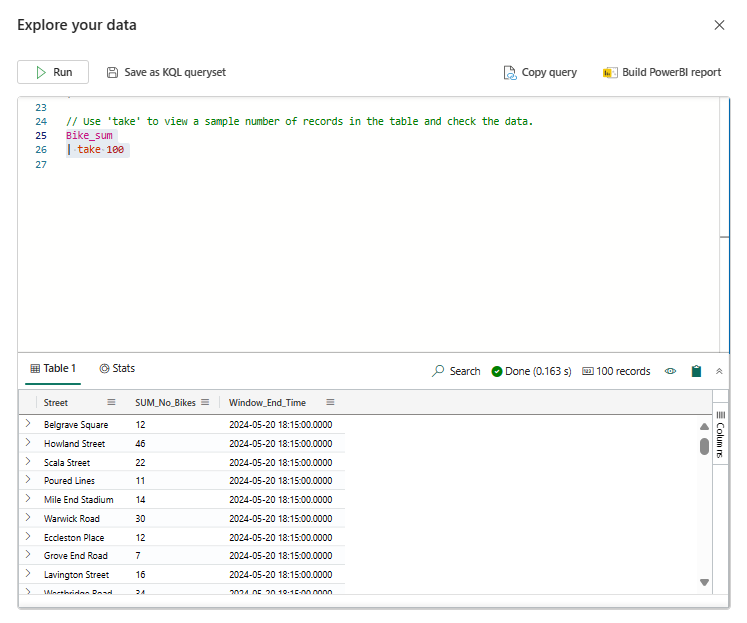

4. Return to the data tree to select the next query **Summarize ingestion per hour**, which uses `summarize` operator to count the number of records ingested in a given interval.

   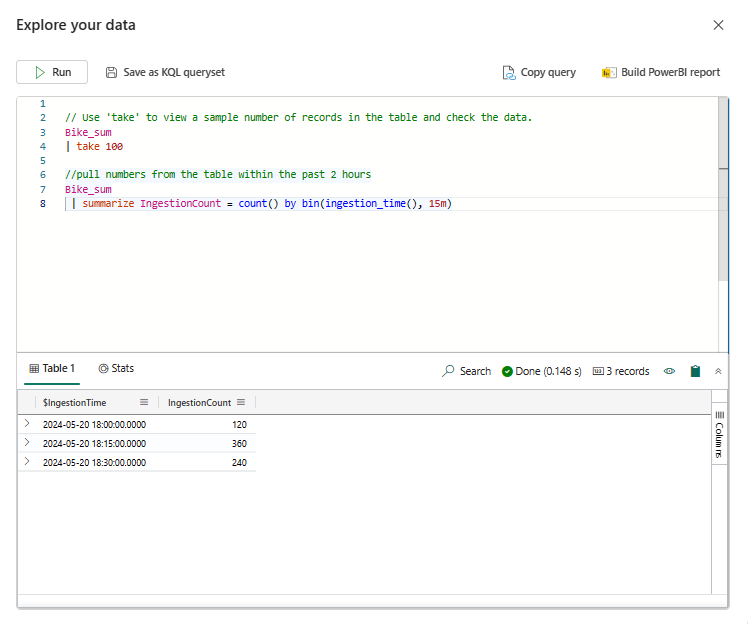

> **Note**: You may see a warning that you have exceeded query limits. This behavior will vary depending on the amount of data streamed into your database.

You can continue to navigate using the built-in query functions to familiarize yourself with your data.

## Query with Copilot

The query editor supports the use of T-SQL in addition to its primary query Kusto Query Language (KQL). T-SQL can be useful for tools that are unable to use KQL. For more information, see [Query data using T-SQL](https://learn.microsoft.com/en-us/azure/data-explorer/t-sql)

1. Back In the Data tree, select the **More menu** [...] on the MyStockData table. Select **Query table > SQL > Show any 100 records**.

   [ 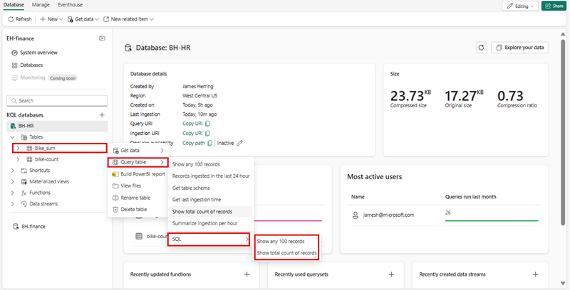 ](./Images/sql-query-sample-large.png)

2. Place your cursor somewhere within the query and select **Run** or press **Shift + Enter**.

   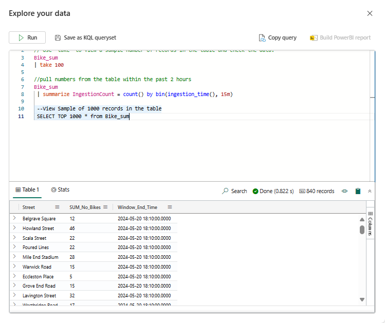

You can continue to navigate using the build-in functions and familiarize yourself with the data using SQL or KQL. 

## Features with Queryset

Querysets in KQL (Kusto Query Language) databases are used for a variety of purposes, primarily for running queries, viewing, and customizing query results on data from a KQL database. They are a key component in Microsoft Fabric's data querying capabilities, allowing users to:

 - **Execute Queries:** Run KQL queries to retrieve data from a KQL database.
 - **Customize Results:** View and modify the query results, making it easier to analyze and interpret the data.
 - **Save and Share Queries:** Create multiple tabs within a queryset to save queries for later use or share them with others for collaborative data exploration.
 - **Support SQL Functions:** While using KQL for creating queries, querysets also support many SQL functions, providing flexibility in data querying.
 - **Leverage Copilot:** Once you have saved queries as a KQL Queryset, you can then view

To save a Queryset is straightforward and has a couple of approaches. 

1. In your **KQL database** while using the **Explore your data** tool, you can simply select **Save as KQL queryset**

   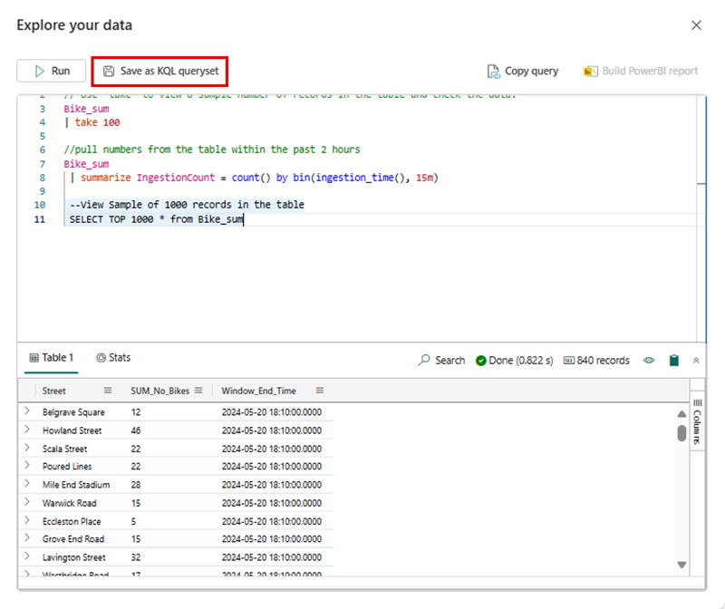

2. Another approach is from the Real-Time Intelligence landing page by selecting the **KQL Queryset** button from the page and then naming your **queryset**

   

3. Once you're in the **Queryset landing page** you will see a **Copilot** button on the tool bar, select this to open the **Copilot pane** to ask questions about the data.

    [ 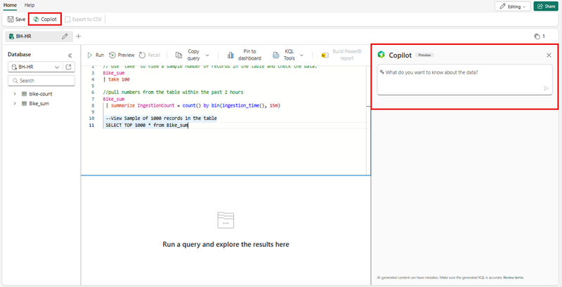 ](./Images/open-copilot-in-queryset-large.png)

4. In the **Copilot pane** you simply type your question and **Copilot** will generate the KQL query and allow you to ***copy*** or ***insert** the query into your queryset window. 

    [ 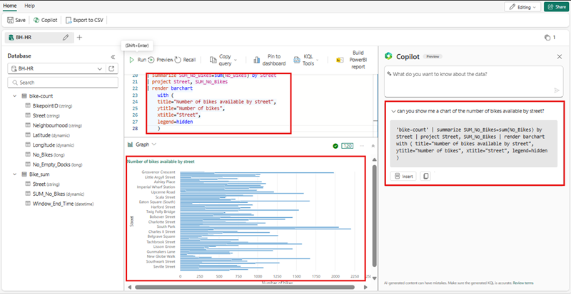 ](./Images/copilot-queryset-results-large.png)

5. From this point, you have the option to take individual queries and use them in dashboards or Power BI Reports using the **Pin to dashboard** or **Build PowerBI Report** buttons.

## Clean up resources

In this exercise, you have created a KQL database and set up continuous streaming with eventstream. After that you queried the data using KQL and SQL. When you've finished exploring your KQL database, you can delete the workspace you created for this exercise.
1. In the bar on the left, select the icon for your workspace.
2. In the **...** menu on the toolbar, select **Workspace settings**.
3. In the **General** section, select **Remove this workspace**.
.
