---
lab:
    title: 'Use Data Activator in Fabric'
    module: 'Get started with Data Activator in Microsoft Fabric'
---

# Use Data Activator in Fabric

Data Activator in Microsoft Fabric takes action based on what's happening in your data. Data Activator lets you monitor your data and create triggers to react to your data changes.

This lab takes approximately **30** minutes to complete.

> **Note**: You need a [Microsoft Fabric trial](https://learn.microsoft.com/fabric/get-started/fabric-trial) to complete this exercise.

## Create a workspace

Before working with data in Fabric, create a workspace with the Fabric trial enabled.

1. On the [Microsoft Fabric home page](https://app.fabric.microsoft.com/home?experience=fabric) at `https://app.fabric.microsoft.com/home?experience=fabric`, select **Data Activator**.
1. In the menu bar on the left, select **Workspaces** (the icon looks similar to &#128455;).
1. Create a new workspace with a name of your choice, selecting a licensing mode that includes Fabric capacity (*Trial*, *Premium*, or *Fabric*).
1. When your new workspace opens, it should be empty.

    

In this lab, you´ll use the Data Activator in Fabric to create a *reflex*. Data Activator conveniently provides a sample dataset that you can use to explore Data Activator's capabilities. You´ll use this sample data to create a *reflex* that analyzes some real-time data and creates a trigger to send an email out when a condition is met.

> **Note**: The Data Activator sample process generates some random data in the background. The more complex your conditions and filters are, the more time it takes to trigger them. If you don't see any data in the graph, wait a few minutes and refresh the page. That said, you don't need to wait for the data to be displayed in the graphs to continue with the lab.

## Scenario

In this scenario, you're a data analyst for a company that sells and ships a range of products.  You're responsible for the data of all shipments and sales to the city of Redmond. You want to create a reflex that monitors the packages that are out for delivery. One category of products you ship is medical prescriptions that need to be refrigerated at a particular temperature during transit. You want to create a reflex that sends an email to the shipping department if the temperature of a package containing a prescription is higher or lower than a certain threshold. The ideal temperature should be between 33 degrees and 41 degrees. Since the reflex events already contain a similar trigger, you create one specifically for the packages shipped to the city of Redmond. Let's get started!

## Create a reflex

1. Ensure you're in the Data Activator Home screen by verifying that the icon on the lower right reflects the Data Activator. Let's create a new reflex by selecting the **reflex (Preview)** button.

    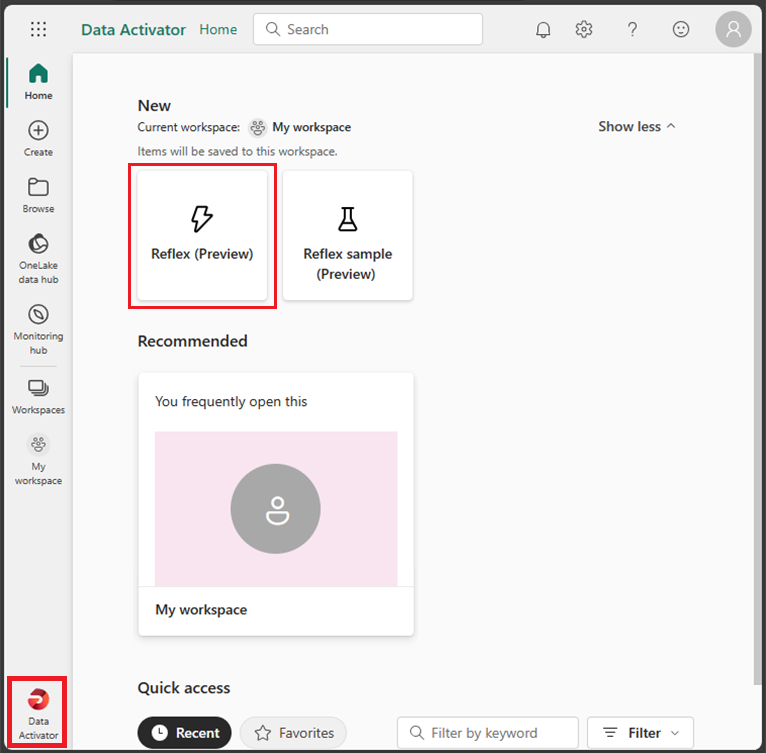

1. On a real production environment, you would use your own data. However, for this lab, you use the sample data provided by Data Activator. Select the **Use Sample Data** button to finish creating your reflex.

    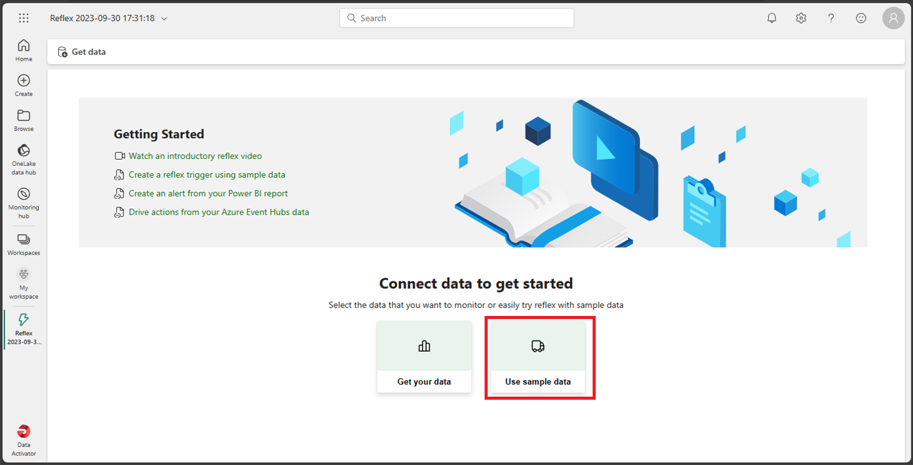

1. By default, Data Activator creates your reflex with the name *Reflex YYYY-MM-DD hh:mm:ss*. Since you may have multiple reflexes in your workspace, you should change the default reflex's name to a more descriptive one. Select the pulldown besides the current reflex name on the upper left-hand corner and change the name to ***Contoso Shipping Reflex*** for our example.

    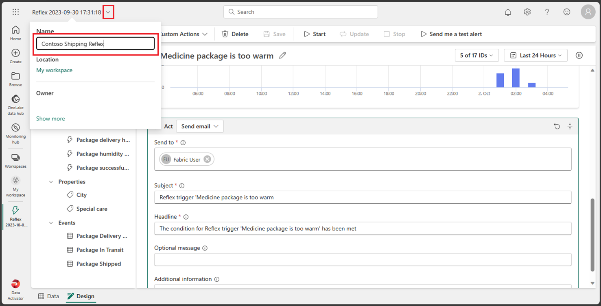

Our reflex is now created and we can start adding triggers and actions to it.

## Get familiar with the reflex home screen

The reflex's home screen is divided into two sections, the *Design* mode the *Data* mode. You can select the mode by selecting the respective tab on the bottom left of the screen.  The *Design* mode tab is where you define your objects with your triggers, properties and events. The *Data* mode tab is where you can add your data sources and view the data that your reflex processes. Let's take a look at the *Design* mode tab, which should be opened by default when you create your reflex.

### Design mode

If you're not currently in *Design* mode, select the **Design** tab on the bottom left of the screen.

To get familiar with the *Design* mode, select the different sections of the screen, triggers, properties and events. We cover each section in more detail in the following sections.

### Data mode

If you're not currently in *Data* mode, select the **Data** tab on the bottom left of the screen. In a real world example, you would add your own data sources from your EventStreams and Power BI visuals here. For this lab, you´re using the sample data provided by Data Activator. This sample is already set up with three EventStreams that are monitoring the package delivery status.

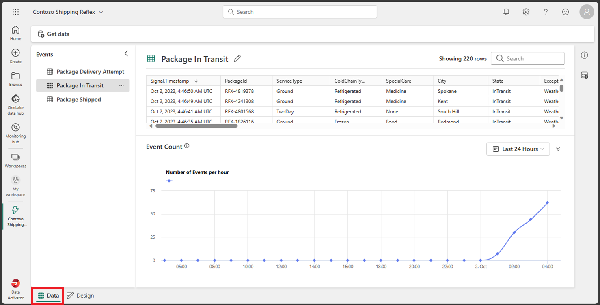

Select each of the different events and observe the data being used in the stream.

It's time to add a trigger to our reflex, but first, let's create a new object.

## Create an object

In a real world scenario, there might not be a need to create a new object for this reflex since the Data Activator sample already includes an object called *Package*. But for this lab, we create a new object to demonstrate how to create one. Let's create a new object called *Redmond Packages*.

1. If you're not currently in *Data* mode, select the **Data** tab on the bottom left of the screen.

1. Select the ***Package In Transit*** event. Pay close attention to the values in the *PackageId*, *Temperature*, *ColdChainType*, *City*, and *SpecialCare* columns. You´ll use these columns to create your trigger.

1. If the *Assign your Data* dialog isn't already open on the right-hand side, select the **Assign your data** button on the right of the screen.

    

1. On the *Assign your data* dialog, select the ***Assign to new object*** tab and enter the following values:

    - **Object Name**: *Redmond Packages*
    - **Assign key column**: *PackageId*
    - **Assign properties**: *City, ColdChainType, SpecialCare, Temperature*

    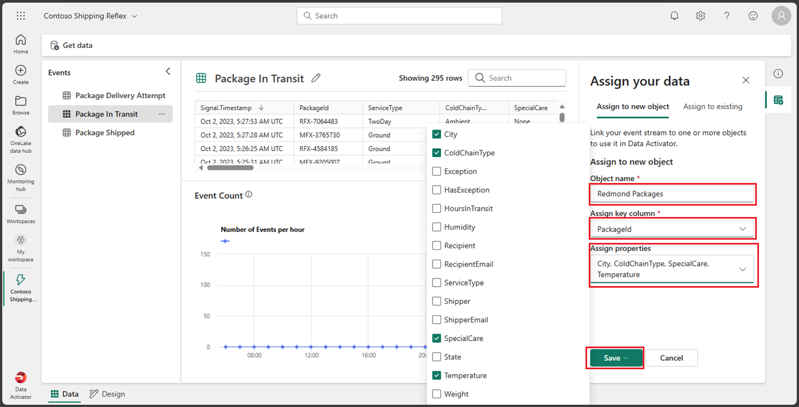

1. Select **Save** and then select **Save and go to design mode**.

1. You should now be back in the *Design* mode. A new object called ***Redmond Packages*** has been added. Select this new object, expand its *Events* and select the **Package in Transit** event.

    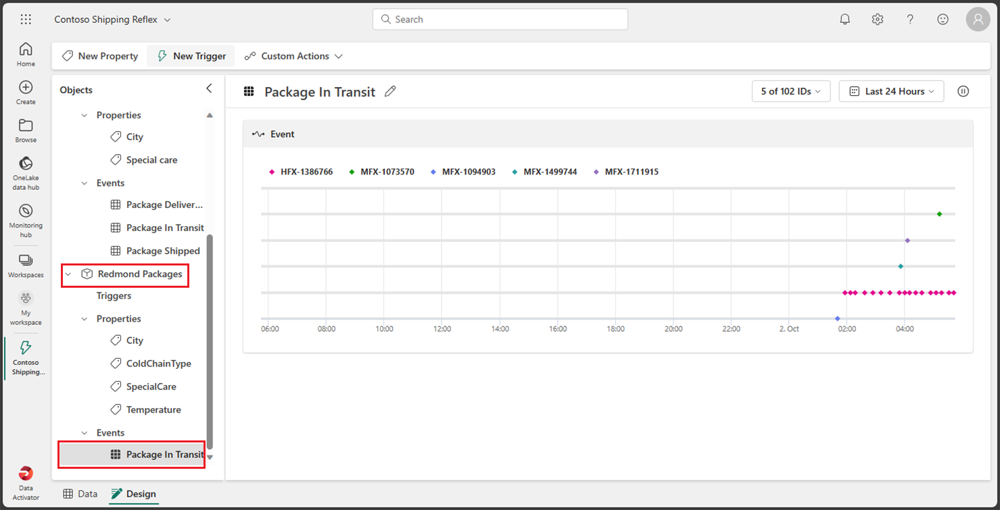

Time to create your trigger.

## Create a trigger

Let's review what you want your trigger to do: *You want to create a reflex that sends an email to the shipping department if the temperature of a package containing a prescription is higher or lower than a certain threshold. The ideal temperature should between 33 degrees and 41 degrees. Since the reflex events already contain a similar trigger, you´ll create one specifically for the packages shipped to the city of Redmond*.

1. Within the *Package In Transit* event from the **Redmond Packages** object select the **New Trigger** button on the top menu. A new trigger is created with the default name of *Untitled*, change the name to ***Medicine temp out of range*** to better define your trigger.

    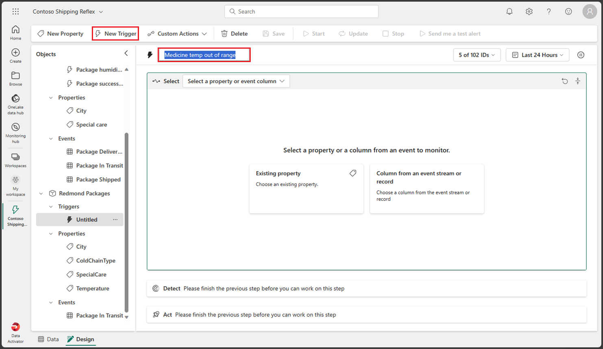

1. Time to select the property or event column that triggers your reflex. Since you created several properties when you created your object, select the **Existing property** button and select the ***Temperature*** property. 

    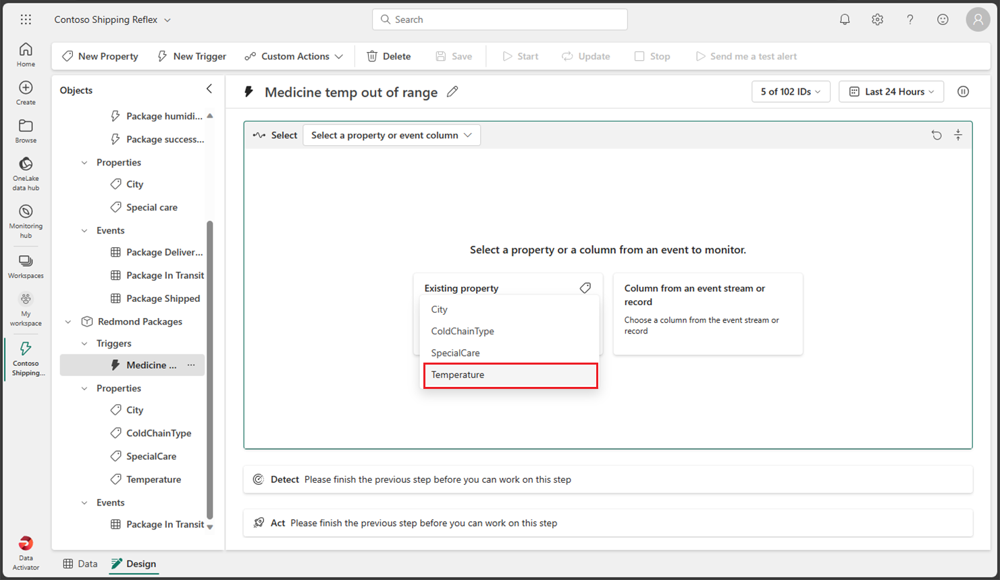

    Selecting this property should return a graph with a sample historic temperature values.

    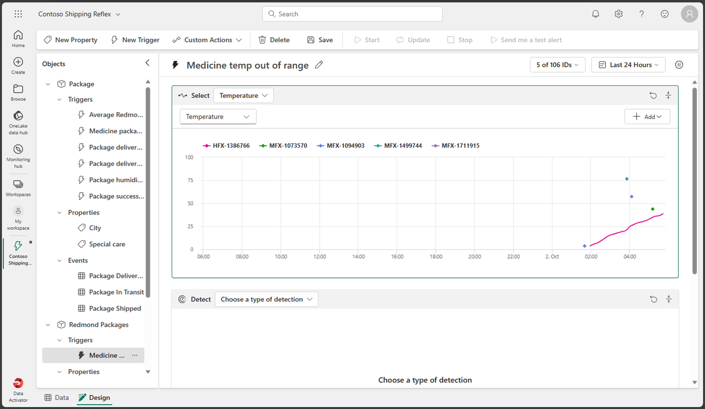

1. Now you need to decide what type of condition you want to trigger from this property. In this case, you want to trigger your reflex when the temperature is above 41 or below 33 degrees. Since we're looking for a numeric range, select the **Numeric** button and select the **Exits range** condition.

    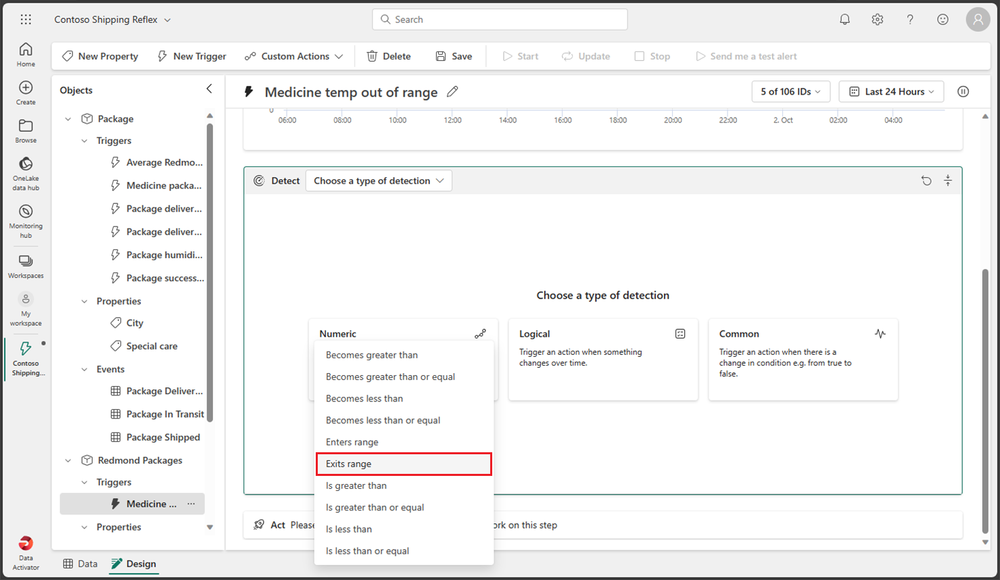

1. Now you need to enter the values for your condition. Enter ***33*** and ***41*** as your range values. Since you choose the *exits numeric range* condition, the trigger should fire when the temperature is below *33* or above *41* degrees.

    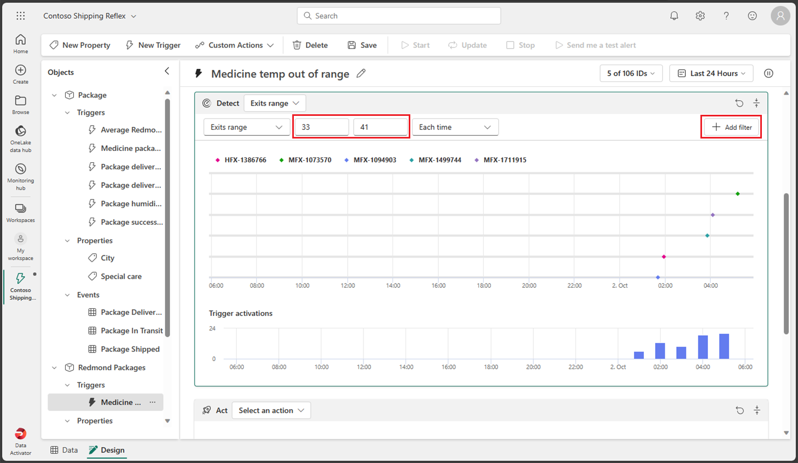

1. So far you´ve defined the property and condition you want the trigger to fire on, but that still doesn't include all the parameters you need. You still need to make sure that the trigger only fires for the *city* of **Redmond** and for the *special care* type of **Medicine**. Let's go ahead and add a couple of filters for those conditions.  Select the **Add filter** button, set the property to ***City*** , set the relationship to ***Equal***, and enter ***Redmond*** as the value. Then, add a new filter with the ***SpecialCare*** property, set it to ***Equal*** and enter ***Medicine*** as the value.

    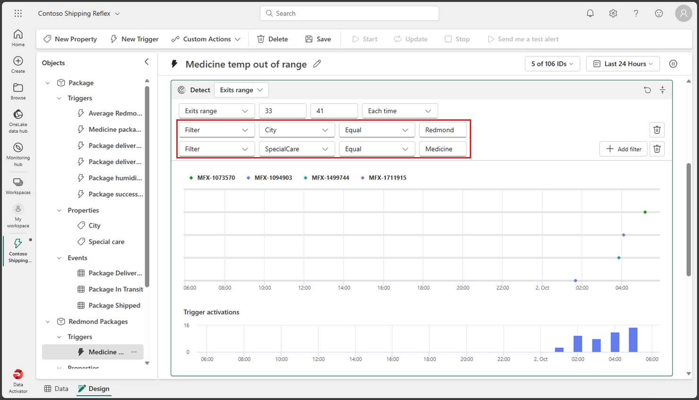

1. Let's add one more filter just to make sure that the medicine is refrigerated. Select the **Add filter** button, set the ***ColdChainType*** property, set it to ***Equal*** and enter ***Refrigerated*** as the value.

    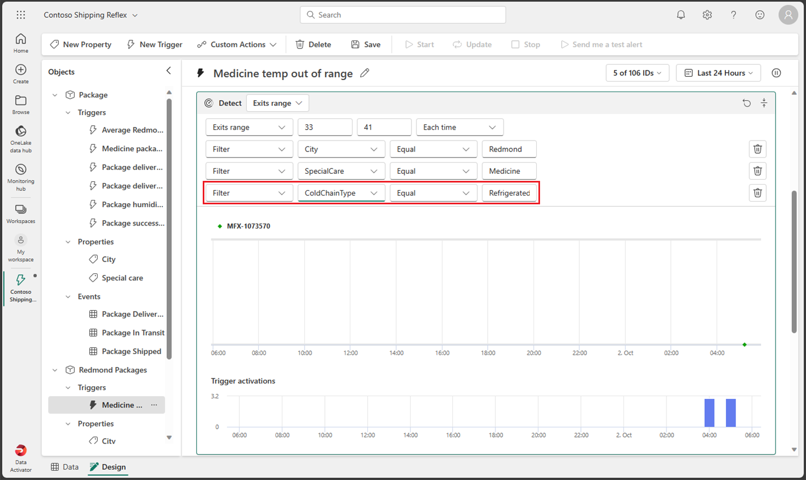

1. You're almost there! You just need to define what action you want to take when the trigger fires. In this case, you want to send an email to the shipping department. Select the **Email** button.

    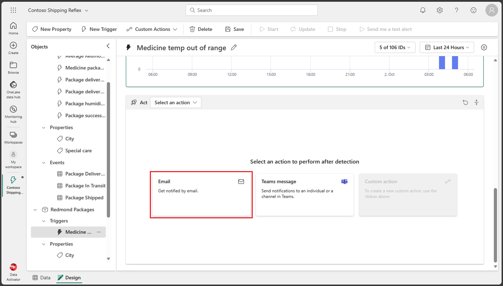

1. Enter the following values for your email action:

    - **Send to**: Your current user account should be selected by default, which should be fine for this lab.
    - **Subject**: *Redmond Medical Package outside acceptable temperature range*
    - **Headline**: *Temperature too high or too low*
    - **Additional information**: Select the *Temperature* property from the checkbox list.

    

1. Select **Save** and then **Start** from the top menu.

You have now created and started a trigger in Data Activator.

## Update and stop a trigger

The only problem with this trigger is that while the trigger sent an email with the temperature, the trigger didn't send the *PackageId* of the package. Let's go ahead and update the trigger to include the *PackageId*.

1. Select the **Packages in Transit** event from the **Redmond Packages** object and select **New Property** from the top menu.

    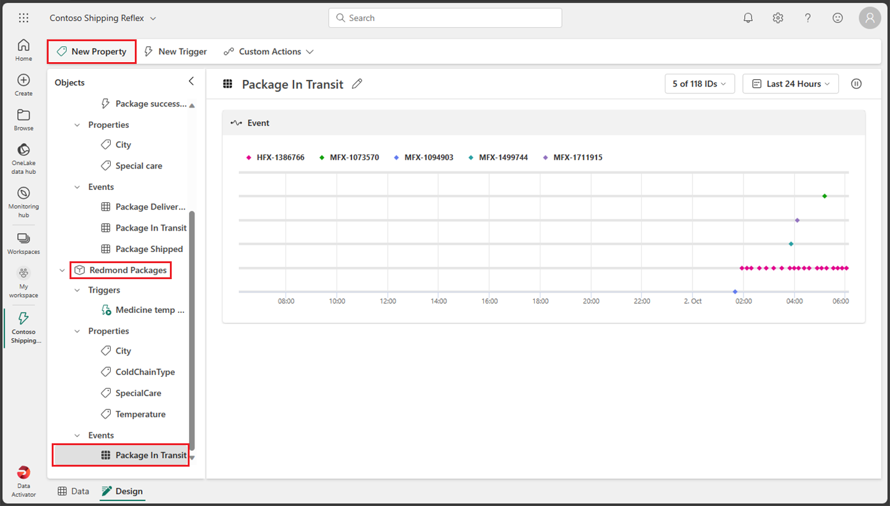

1. Let's add the **PackageId** property by selecting the column from the *Packages in Transit* event. Don't forget to change the property name from *Untitled* to *PackageId*.

    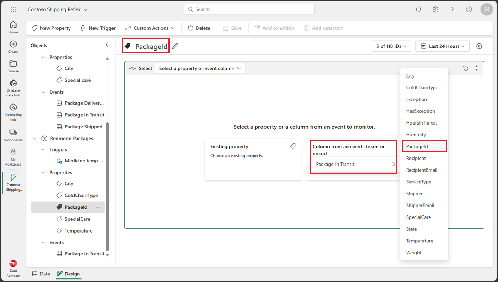

1. Let's update our trigger action. Select the **Medicine temp out of range** trigger, scroll to the **Act** section at bottom, select the **Additional information** and add the **PackageId** property. DO NOT select the **Save** button yet.

    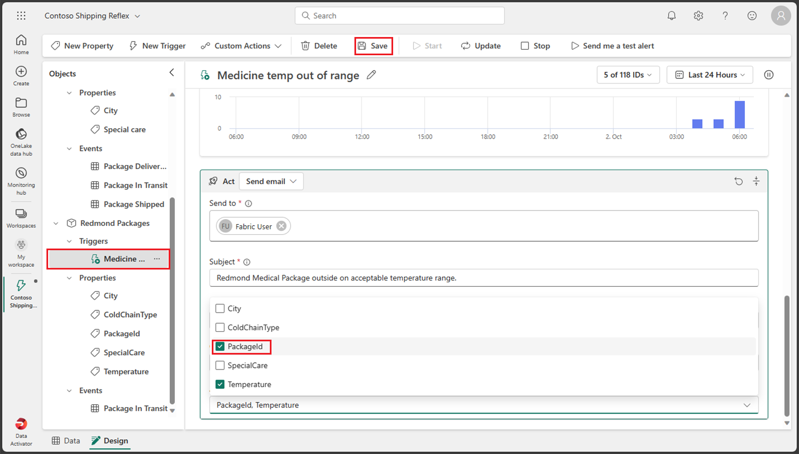

1. Since you updated the trigger, the correct action should be to update and not save the trigger, but for this lab we do the opposite and select **Save** button instead of **Update** button to also see what happens. The reason you should have selected the *Update* button is because when you select to *update* the trigger it both saves the trigger and updates the currently running trigger with the new conditions. If you just select the *Save* button, the currently running trigger doesn't apply the new conditions until you select to update the trigger. Let's go ahead and select the **Save** button.

1. Because you selected to *Save* instead of *Update*, you noticed that the message *There's a property update available. Update now to ensure the trigger has the most recent changes* appears at the top of the screen. The message additionally has an *Update* button. Let's go ahead and select the **Update** button.

    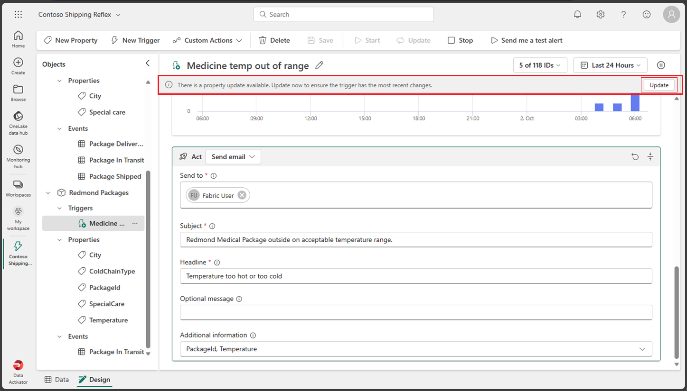

1. Stop the trigger by selecting the **Stop** button from the top menu.

## Clean up resources

In this exercise, you have created a reflex with a trigger in Data Activator. You should now be familiar with the Data Activator interface and how to create a reflex and it objects, trigger and properties.

If you've finished exploring your Data Activator reflex, you can delete the workspace you created for this exercise.

1. In the bar on the left, select the icon for your workspace to view all of the items it contains.
2. In the **...** menu on the toolbar, select **Workspace settings**.
3. In the **General** section, select **Remove this workspace**.
