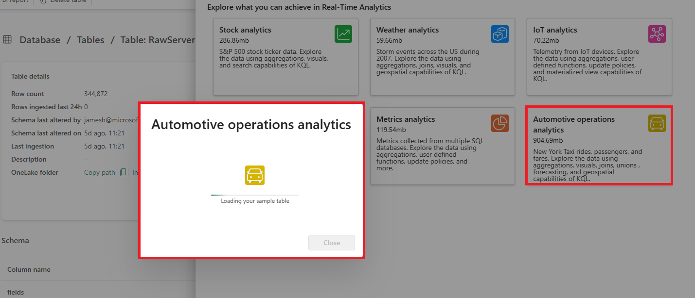
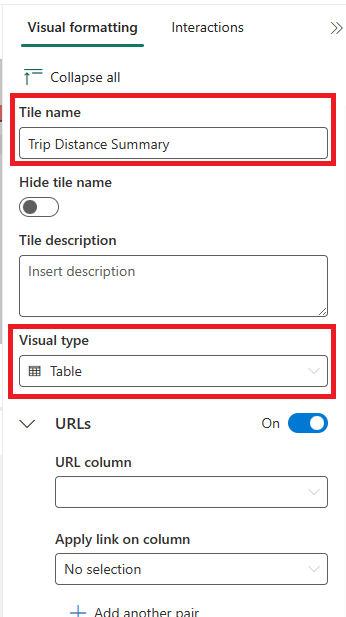

## ***WORKING DRAFT**
---
lab:
    title: 'Real-time dashboards'
    module: 'Query data from a Kusto Query database in Microsoft Fabric'
---

# Get started with querying a Kusto database in Microsoft Fabric
Real-time dashboards allow you to glean insight from within Microsoft Fabric using the Kusto Query Language (KQL) to retrieve both structure and unstructured data and render it in charts, scatterplots, tables, and more within panels that allow for linking similar to slicers within Power BI. 

This lab takes approximately **25** minutes to complete.

> **Note**: You need a Microsoft *school* or *work* account to complete this exercise. If you don't have one, you can [sign up for a trial of Microsoft Office 365 E3 or higher](https://www.microsoft.com/microsoft-365/business/compare-more-office-365-for-business-plans).

## Activate a Microsoft Fabric trial

1. After signing up for a Microsoft Fabric account, navigate to the Microsoft Fabric portal at [https://app.fabric.microsoft.com](https://app.fabric.microsoft.com).
1. Select the **Account Manager** icon (the *user* image at the top right)
1. In the account manager menu, select **Start trial** to start a Microsoft Fabric trial.
1. After successfully upgrading to Microsoft Fabric, navigate to the home page by selecting **Fabric Home Page**.

## Create a workspace

Before working with data in Fabric, create a workspace with the Fabric trial enabled.

1. On the [Microsoft Fabric home page](https://app.fabric.microsoft.com), select **Real-Time Analytics**.
1. In the menu bar on the left, select **Workspaces** (the icon looks similar to &#128455;).
1. Create a new workspace with a name of your choice, selecting a licensing mode that includes Fabric capacity (*Trial*, *Premium*, or *Fabric*).
1. When your new workspace opens, it should be empty.

    

In this lab, you use the Real-Time Analytics (RTA) in Fabric to create a KQL database from a sample eventstream. Real-Time Analytics  conveniently provides a sample dataset that you can use to explore RTA's capabilities. You use this sample data to create KQL | SQL queries and querysets that analyzes real-time data and allow for other uses in downstream processes.

## Create a KQL Database

1. Within the **Real-Time Analytics**, select the **KQL Database** box.

   

2. You're prompted to **Name** the KQL Database

   

3. Give the KQL Database a name that you remember, such as **MyStockData**, press **Create**.

4. In the **Database details** panel, select the pencil icon to turn on availability in OneLake.

   

5. Select **sample data** box from the options of ***Start by getting data***.
 
   

6. choose the **Automotive Metrics analytics** box from the options for sample data.

   

7. Once the data is finished loading, we can verify the KQL Database is populated.

   

7. Once the data is loaded, verify the data is loaded into the KQL database. You can accomplish this operation by selecting the ellipses to the right of the table, navigating to **Query table** and selecting **Show any 100 records**.

    

   > **NOTE**: The first time you run this, it can take several seconds to allocate compute resources.

    


## Scenario
In this scenario, you'll create a real-time dashboard based on sample data provided by Microsoft Fabric that will allow you to display data in a variety of methods, create a variable, and use this variable to link the dashboard panels together to gain deeper insight into what is going on within the source system(s). In this module we use the NY Taxi Dataset to look at the current details of trips by borough and the like.

1. Navigate to **Real-Time Analytics** and then select **Real-Time Dashboard** on the Fabric main page.

    

1. Press on tne **Add New Tile** button.

```kusto

Trips
| summarize ["Total Trip Distance"] = sum(trip_distance) by pickup_boroname
| project Borough = case(isempty(pickup_boroname) or isnull(pickup_boroname), "Unidentified", pickup_boroname), ["Total Trip Distance"]
| sort by Borough asc 

```
3. Press the Run button and verify your query has no errors.
4. On the right side of the panel, select the **Visual formatting** tab and complete the ***Tile name*** and ***Visual type***.

   

