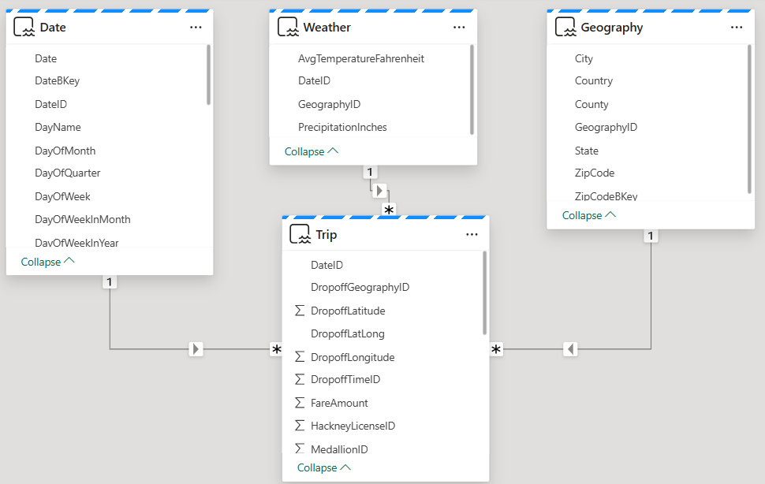
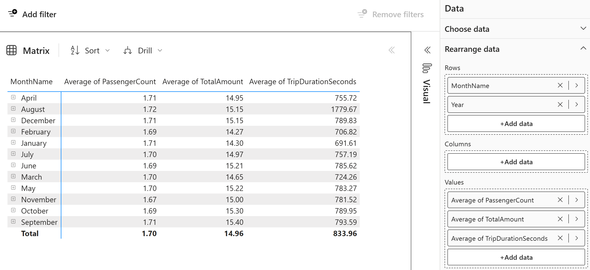
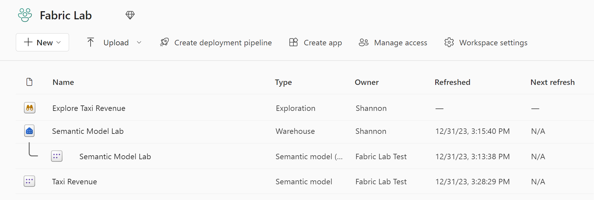

---
lab:
    title: 'Create and explore a semantic model'
    module: 'Understand scalability in Power BI'
---

# Create and explore a semantic model

In this exercise, you'll use Microsoft Fabric to develop a data model for the sample NY Taxi data in a data warehouse.

You'll practice:

- Creating a custom semantic model from a Fabric data warehouse.
- Create relationships and organize the model diagram.
- Explore the data in your semantic model directly in Fabric.

This lab takes approximately **30** minutes to complete.

> **Note**: You need a [Microsoft Fabric trial](https://learn.microsoft.com/fabric/get-started/fabric-trial) to complete this exercise.

## Create a workspace

Before working with data in Fabric, create a workspace with the Fabric trial enabled.

1. On the [Microsoft Fabric home page](https://app.fabric.microsoft.com), select **Synapse Data Engineering**.
1. In the menu bar on the left, select **Workspaces** (the icon looks similar to &#128455;).
1. Create a new workspace with a name of your choice, selecting a licensing mode that includes Fabric capacity (*Trial*, *Premium*, or *Fabric*).
1. When your new workspace opens, it should be empty.

## Create a data warehouse and load sample data

Now that you have a workspace, it's time to create a data warehouse. The Synapse Data Warehouse home page includes a shortcut to create a new warehouse:

1. In the **Synapse Data Warehouse** home page, create a new **Warehouse** with a name of your choice.

    After a minute or so, a new warehouse will be created:
    
    

1. In the center of the data warehouse user interface, you'll see a few different ways to load data into your warehouse. Select **Sample data** to load NYC Taxi data into your data warehouse. This will take a couple of minutes.

1. After your sample data has loaded, use the **Explorer** pane on the left to see what tables and views already exist in the sample data warehouse.

1. Select the **Reporting** tab of the ribbon and choose **New semantic model**. This enables you to create a new semantic model using only specific tables and views from your data warehouse, for use by data teams and the business to build reports.

1. Name the semantic model **Taxi Revenue**, ensure it's in the workspace you just created, and select the following tables:
   - Date
   - Trip
   - Geography
   - Weather
     
   
     
## Create relationships between tables

Now you'll create relationships between the tables to accurrately analyze and visualize your data. If you're familiar with creating relationships in Power BI desktop, this will look familiar.

1. Navigate back to your workspace and confirm that you see your new semantic model, Taxi Revenue. Notice that the item type is **Semantic model**, as opposed to the **Semantic model (default)** that is automatically created when you create a data warehouse.

     *Note: A default semantic model is created automatically when you create a Warehouse or SQL analytics endpoint in Microsoft Fabric, and it inherits the business logic from the parent Lakehouse or Warehouse. A semantic model that you create yourself, as we've done here, is a custom model that you can design and modify according to your specific needs and preferences. You can create a custom semantic model by using Power BI Desktop, Power BI service, or other tools that connect to Microsoft Fabric.*

1. Select **Open data model from the ribbon**.
   
    Now, you'll create relationships between the tables. If you're familiar with creating relationships in Power BI desktop, this will look familiar!

    *Reviewing the star schema concept, we'll organize the tables in our model into a Fact table and Dimension tables. In this model, the **Trip** table is our fact table, and our dimensions are **Date**, **Geography**, and **Weather**.*

1. Create a relationship between the **Date** table and the **Trip** table using the **DateID** column. **Select the DateID column** in the **Date** table and **drag and frop it on top of the DateID column in the Trip table**. Alternatively, you can select **Manage relationships** from the ribbon, followed by **New relationship**.

1. Ensure the relationship is a **One to many** relationship from the **Date** table to the **Trip** table.

1. Create relationships to the **Trip** fact table from the **Geography** and **Weather** dimensions, repeating the step above. Also ensure these relationships are **One to many**, with one occurance of the key in the dimension table, and many in the fact table. 

1. Drag the tables into position so that the **Trip** fact table is located at the bottom of the diagram, and the remaining tables, which are dimension tables, are located around the fact table.

    

    *The creation of the star schema model is now complete. There are many modeling configurations that could now be applied, like adding hierarchies, calculations, and setting properties like column visibility.*

    > **Tip**: In the Properties pane of the window, toggle *Pin related fields to top of card* to Yes. This will help you (and others reporting off of this model) see which fields are being used in relationships at a glance. You can also interact with the fields in your tables using the properties pane. For example, if you want to confirm data types are set properly, you can select a field and review the format in the properties pane.

     

## Explore your data

You now have a semantic model built off your warehouse that has relationships established that are necessary for reporting. Let's take a look at the data using the **Explore data** feature.

1. Navigate back to your workspace and select your **Taxi Revenue semantic model**.

1. In the window, select **Explore this data** from the ribbon. Here you'll take a look at your data in tabular format. This offers a focused experience to explore your data without creating a full Power BI report.

1. Add **YearName** and **MonthName** to the rows, and explore the **average number of passengers**, **average trip amount**, and **average trip duration** in the values field well.

    *When you drag and drop a numeric field into the explore pane, it will default to summarize the number. To change the aggregation from **Summarize** to **Average**, select the field and change the aggregation in the popup window.*

    

1. To look at this data as a visual rather than just a matrix, select **Visual** at the bottom of the window. Select a bar chart to quickly visualize this data.

   *A bar chart is not the best way to look at this data. Play around with the different visuals and the fields you're looking at in the "Rearrange data" section of the Data pane on the right side of the screen.*

1. You can now save this Exploration view to your workspace by clicking the **Save** button in the top left corner. You also have the ability to **Share** the view by selecting **Share** in the upper right corner. This will enable you to share the data exploration with colleagues.

1. After you have Saved your exploration, navigate back to your workspace to see your data warehouse, default semantic model, the semantic model you created, and your exploration.

    

